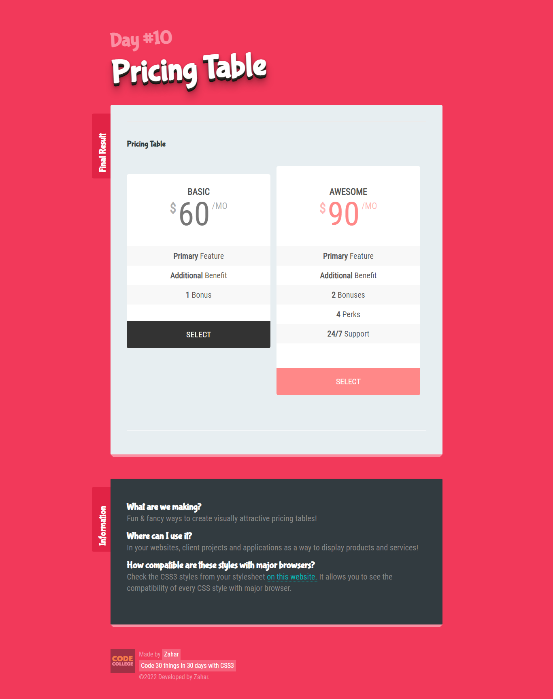

# pricingtable-css3

    

    float:left
    vertical-align: top;
    .final__pricing-body ul li:nth-child(2n) {
       background-color: #ffffff;
     }
    .final__pricing-body ul li:nth-child(2n+1) {
       background-color: #f8f8f8;
     }
   
   

   
   
